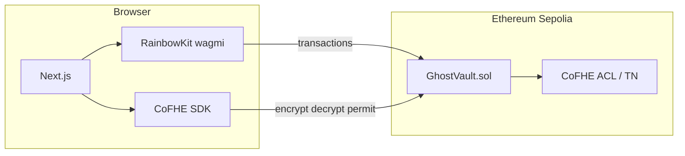

# GhostVault

GhostVault is a **programmable private wallet** demo: balances and amounts stay **encrypted on Ethereum Sepolia** using **Fhenix CoFHE** (fully homomorphic encryption). You encrypt inputs in the browser, the contract computes on ciphertexts, and you decrypt results locally with your **CoFHE permit**.

## What it is for

- **Builders & judges (hackathons)** — Shows an end-to-end FHE flow: `encrypt → on-chain FHE ops → decrypt`, not just a normal ERC-20 UI.
- **Privacy-minded users (testnet)** — Experiment with **hidden balances**, **private transfers**, **encrypted rule checks**, and **selective disclosure** (ACL grant to an auditor address) without claiming mainnet production security.
- **DeFi researchers** — The **Trade** page stores an **encrypted trade intent** so the *idea* of hidden size / MEV-resistant flow is visible; a full DEX integration is roadmap work.

## What makes it different from a normal wallet

| Typical wallet        | GhostVault (this MVP)                   |
|----------------------|-------------------------------------------|
| Public balance       | Encrypted balance (`euint64`)             |
| Clear transfer amount | Encrypted amount (`InEuint64`)          |
| Clear strategies     | Encrypted threshold + encrypted boolean   |

## Architecture



1. **Wallet** — You connect with **RainbowKit** (WalletConnect + injected wallets). There is no email/password; identity is the connected address.
2. **CoFHE client** — After connection, the app uses **`@cofhe/sdk/web`** plus the **`WagmiAdapter`** to attach viem clients, then **`permits.getOrCreateSelfPermit()`** for decryption.
3. **Contract** — [`contracts/contracts/GhostVault.sol`](contracts/contracts/GhostVault.sol) stores **encrypted balances**, supports **private transfer**, **rule threshold + refresh**, **trade intent**, and **`grantBalanceViewer`** for ACL.

## Repository layout

| Path | Purpose |
|------|---------|
| [`contracts/`](contracts/) | Hardhat + `@cofhe/hardhat-plugin`, Solidity, tests, deploy script |
| [`web/`](web/) | Next.js App Router UI (black/white + dotLottie on homepage) |
| [`proejct.md`](proejct.md) | Original product brief |

## Prerequisites

- **Node.js 18+**
- **npm** (or pnpm/yarn with equivalent commands)
- A **WalletConnect Cloud** project ID for **`NEXT_PUBLIC_WALLETCONNECT_PROJECT_ID`**
- **Sepolia ETH** for gas + deploy (from a public faucet)
- **Fhenix CoFHE** is supported on **Ethereum Sepolia** (chain id **11155111**) — see [Fhenix compatibility](https://cofhe-docs.fhenix.zone/get-started/introduction/compatibility).

## Smart contracts

```bash
cd contracts
npm install
npm test
```

Deploy to Sepolia (requires `PRIVATE_KEY` and optional `SEPOLIA_RPC_URL` in `contracts/.env`):

```bash
# contracts/.env
PRIVATE_KEY=0x...your_test_key...
SEPOLIA_RPC_URL=https://rpc.sepolia.org

npm run deploy:sepolia
```

This writes **`contracts/deployments/eth-sepolia.json`** (address + ABI). Copy the address into the web app env.

### Verify on Etherscan (optional)

Use Hardhat verify or the Etherscan UI with compiler **0.8.28**, **EVM Cancun**, and the flattened `GhostVault` source.

## Web app

```bash
cd web
cp .env.example .env.local
# fill NEXT_PUBLIC_WALLETCONNECT_PROJECT_ID and NEXT_PUBLIC_GHOSTVAULT_ADDRESS
npm install
npm run dev
```

Open [http://localhost:3000](http://localhost:3000).

Production build:

```bash
npm run build
npm start
```

## Environment variables

| Variable | Where | Description |
|----------|--------|-------------|
| `PRIVATE_KEY` | `contracts/.env` | Deployer key (never commit) |
| `SEPOLIA_RPC_URL` | `contracts/.env` | Optional; defaults to public Sepolia RPC in Hardhat config |
| `NEXT_PUBLIC_WALLETCONNECT_PROJECT_ID` | `web/.env.local` | WalletConnect project id |
| `NEXT_PUBLIC_GHOSTVAULT_ADDRESS` | `web/.env.local` | Deployed `GhostVault` address on Sepolia |

## Pages

| Route | Feature |
|-------|---------|
| `/` | Landing: value prop + **dotLottie** hero (right column) |
| `/dashboard` | Decrypt **encrypted balance**, **deposit** (encrypted) |
| `/send` | **Private transfer** to another address |
| `/trade` | **Encrypted trade intent** (demo slot) |
| `/rules` | **Encrypted threshold** + **refresh rule check** → decrypt boolean |
| `/permissions` | **`grantBalanceViewer`** for selective disclosure |

## End-to-end test (Sepolia)

1. Deploy the contract and set `NEXT_PUBLIC_GHOSTVAULT_ADDRESS`.
2. Connect a wallet on **Sepolia** (use the in-app network switcher if needed).
3. **Dashboard** — deposit a small uint64 amount; balance should decrypt after the tx confirms.
4. **Send** — transfer part of the balance to a second wallet (both need Sepolia ETH for gas).
5. **Rules** — set threshold, run **Run rule check** (transaction), then read true/false.
6. **Permissions** — optional: grant another address ACL on your balance handle.

## Roadmap / limitations

- **Privara** and full **confidential payroll** flows are **not** integrated here (spec mentions them as future work).
- **Trade** does **not** route to a real DEX; it only stores an encrypted intent for the demo.
- **On-chain history** is still publicly observable (tx hashes); “hidden history” in the brief is **not** fully solved here.
- **CoFHE + wagmi** types differ slightly; the app uses narrow casts for `WagmiAdapter` / `connect` — upgrade `@cofhe/sdk` when upstream aligns with your **viem** major version.

## Security

- **Never commit private keys or `.env` files** with real funds.
- This is a **testnet** educational project, not a security audit.

## License

MIT — see `contracts` and `web` package licenses as applicable.
